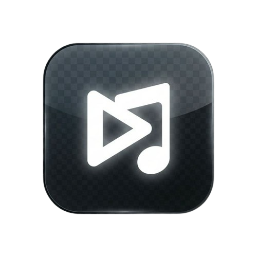

<div align="center">



# Spotify Float — Mini Player

**A floating, resizable Picture-in-Picture mini-player for Spotify Web.**
No Spotify API. No Premium required. Just open the tab and play.

[](https://github.com/Arnab500th/Spotify-miniplayer-chrome-extension-By-pass-premium-pay-walls)
[](https://developer.chrome.com/docs/extensions/mv3/intro/)
[](LICENSE)
[](manifest.json)

<br/>


<!-- Replace the above with a real screenshot once uploaded -->

</div>

---

## ✨ What It Does

Spotify Float injects a **floating mini-player** directly onto the Spotify Web page. The player sits above everything else, is fully draggable and resizable, and gives you complete playback control without switching tabs. It also supports a true **Document Picture-in-Picture** mode — a separate always-on-top window showing album art and controls.

Works on the **free tier** of Spotify Web. No authentication, no API keys, no data collection.

---

## 🎯 Features

| Feature | Details |
|---|---|
| 🎵 Playback Controls | Play/pause, next, previous, shuffle, repeat |
| 🔊 Volume Control | Slider + mute toggle |
| ⏩ Drag-to-Seek | Click or scrub the progress bar to any position |
| 🖼️ Picture-in-Picture | Always-on-top OS window with album art overlay |
| 🎨 Three UI Modes | Full (art + info + controls), Compact, Mini pill |
| 📌 Draggable & Resizable | Freely position and resize, persisted across sessions |
| 💾 State Persistence | Position, size, mode and visibility saved via `chrome.storage` |
| ⌨️ Keyboard Shortcuts | `Space`, `Ctrl+→`, `Ctrl+←` |
| 🛡️ Shadow DOM | Fully isolated from Spotify's own styles and scripts |
| ⚡ Performance | Sync loop pauses when player is hidden; no background polling |

---

## 📦 File Structure

```
spotify-miniplayer/
├── manifest.json          ← MV3 manifest (permissions, scripts, icons)
├── background.js          ← Service worker: message routing + tab lifecycle
├── content.js             ← Bundled content script: UI + sync + controls
├── selectors.js           ← Resilient DOM selector map with fallbacks
├── ui.js                  ← Shadow DOM UI module (drag, resize, modes)
├── popup.html             ← Toolbar popup interface
├── popup.js               ← Toolbar popup logic
├── generate-icons.js      ← Node.js icon generator (no dependencies)
└── icons/
    ├── icon16.png
    ├── icon48.png
    └── icon128.png
```

---

## 🚀 Installation

> No Chrome Web Store listing yet — load it manually in Developer Mode.

**Step 1 — Clone the repo**

```bash
git clone https://github.com/Arnab500th/Spotify-miniplayer-chrome-extension-By-pass-premium-pay-walls.git
cd Spotify-miniplayer-chrome-extension-By-pass-premium-pay-walls
```

**Step 2 — Generate icons** *(skip if `icons/` folder already has PNGs)*

```bash
node generate-icons.js
```

**Step 3 — Load in Chrome**

1. Navigate to `chrome://extensions`
2. Enable **Developer Mode** (toggle, top-right)
3. Click **Load unpacked**
4. Select the cloned folder
5. The 🎵 icon appears in your toolbar

**Step 4 — Use it**

1. Open [open.spotify.com](https://open.spotify.com) and start playing a song
2. Click the 🎵 icon in the toolbar
3. Hit **Show Mini Player** — the floating player appears on the page

---

## 🎮 Usage

### Mini Player Modes

Switch between modes using the buttons in the player header:

| Mode | What's shown |
|---|---|
| **FULL** | Album art + track info + progress bar + all controls |
| **CMP** (Compact) | Track info + progress bar + controls, no art |
| **MINI** | Controls-only pill, minimal footprint |

### Picture-in-Picture

Click **Open Picture-in-Picture** in the toolbar popup (or the PiP button inside the player). This opens a separate always-on-top OS window. Move your mouse over it to reveal controls and the seek bar; the album art shows by default.

### Keyboard Shortcuts

| Shortcut | Action |
|---|---|
| `Space` | Play / Pause |
| `Ctrl + →` | Next Track |
| `Ctrl + ←` | Previous Track |

*Shortcuts only fire when focus is not inside a text input on the page.*

### Drag-to-Seek

Click anywhere on the progress bar to jump to that position. Click and drag left/right to scrub — the bar updates live, and Spotify seeks on mouse release.

---

## 🏗️ Architecture

### How it works

Spotify Float does **not** use the Spotify Web API. Instead it reads and controls the player by interacting directly with Spotify's DOM — reading `data-testid` attributes, `aria-label` values, and input element states, then simulating the same events a real click would trigger.

```
chrome toolbar popup
        │  TOGGLE_PLAYER / OPEN_PIP message
        ▼
background.js (service worker)
        │  chrome.tabs.sendMessage → Spotify tab
        ▼
content.js (injected into open.spotify.com)
        │
        ├── FloatUI (Shadow DOM player)
        │     ├── Drag system
        │     ├── Resize system
        │     └── Seek system (mousedown → mousemove → mouseup)
        │
        ├── syncNow()  ──────────────────────────────────────────┐
        │     ├── readText('trackTitle')                          │
        │     ├── readText('artistName')                          │ 500ms interval
        │     ├── cachedResolve('albumArt')                       │ (2000ms when paused)
        │     ├── calcProgress() — 3-strategy fallback            │
        │     └── play/shuffle/repeat state from aria-label       │
        │                                                          │
        └── MutationObserver on now-playing-widget ───────────────┘
              debounced 200ms → invalidateCache() → syncNow()
```

### Selector resilience

`selectors.js` defines a priority-ordered fallback list for every DOM element. The primary selector uses `data-testid` (most stable). If Spotify restructures their DOM, the system automatically falls through to CSS class fallbacks before giving up. Cache TTL is 4 seconds to avoid redundant DOM queries on every sync tick.

### PiP window

Uses the [Document Picture-in-Picture API](https://developer.chrome.com/docs/web-platform/document-picture-in-picture/) (`window.documentPictureInPicture`). A second `FloatUI` instance is mounted into the PiP window's document. Hover detection uses JS `mouseenter`/`mouseleave` events (CSS `:hover` does not work across PiP window boundaries).

---

## 🔧 Updating Selectors

If Spotify updates their web app and controls stop responding:

1. Open Chrome DevTools on `open.spotify.com`
2. Inspect the broken button/element
3. Find its `data-testid` or unique attribute
4. Update the relevant entry in `selectors.js`
5. Go to `chrome://extensions` → click the reload icon

---

## ⚠️ Known Limitations

- **Spotify DOM changes** — Spotify updates their web app regularly. The fallback selector system handles minor changes, but a major redesign may require a `selectors.js` update.
- **Document PiP API** — Requires Chrome 116+. Not available in other browsers.
- **Free tier only tested** — Works on Spotify Free. Premium users can also use it, though Premium already has its own mini-player.
- **No lyrics / queue** — Playback control only. Lyrics and queue require the official API.

---

## 🤝 Contributing

Pull requests are welcome. For significant changes, open an issue first to discuss what you'd like to change.

1. Fork the repo
2. Create a feature branch: `git checkout -b feature/my-feature`
3. Commit your changes: `git commit -m 'Add some feature'`
4. Push to the branch: `git push origin feature/my-feature`
5. Open a Pull Request

---

## 📄 License

[MIT](LICENSE) © 2025 [Arnab500th](https://github.com/Arnab500th)

---

<div align="center">
<sub>Built with ♥ by Arnab · No affiliation with Spotify AB</sub>
</div>